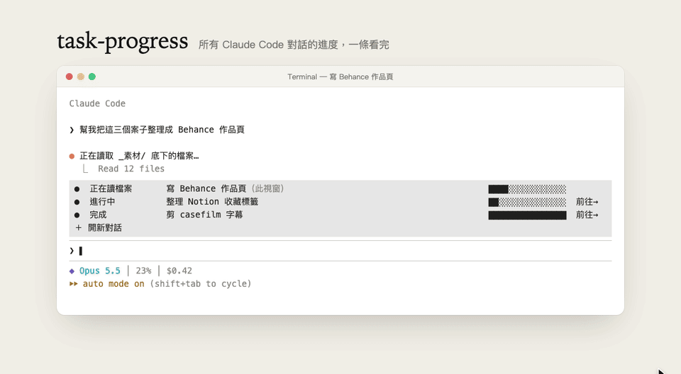
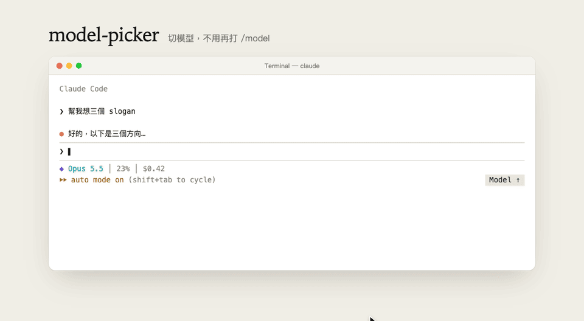

# claude-code-CLI-Mods

Claude Code 終端機版的兩個 mod（hooks plugin）。
Two mods (hooks plugins) for the Claude Code CLI.

## 安裝 Install

在 Claude Code 的輸入框打：

```
/plugin install task-progress --marketplace Vic-Chen-160/claude-code-CLI-Mods
/plugin install model-picker --marketplace Vic-Chen-160/claude-code-CLI-Mods
```

第一次會問要不要加入 marketplace，按 `y`，再選安裝範圍（user）即可。

## task-progress



輸入框上方一條淺灰底的帶子，列出這台電腦上所有 Claude Code session 的任務：

- `●` 進行中／完成，`？`（紅色）等你確認權限或回答問題
- 有 todo 清單時顯示進度條，沒有則是跑馬燈
- `前往→` 跳到那個 session 的 Terminal 分頁
- `＋ 開新對話` 在同一個路徑開新的 Terminal 分頁跑 `claude`
- 完成的任務 30 分鐘後自動消失

> 只支援 macOS 內建的 Terminal.app（跳轉與開新分頁用 AppleScript）。
> 各 session 的狀態寫在 `~/.claude/task-progress/*.json`。

## model-picker



在 `⏵⏵ auto mode on (shift+tab to cycle)` 那一行右端放一顆灰底的 `Model ↑` 按鈕，
點一下等於輸入 `/model`，叫出原生的模型與思考努力程度選單。

> 這一行由 mod 自己重畫：原生文字照抄、模式名稱重新上色，
> 所以原本那行上可點的小按鈕會變成純文字（快捷鍵不受影響）。
> 點擊需要全螢幕模式（`"tui": "fullscreen"`）。

## 開發 Develop

```
claude plugin validate ./model-picker
claude plugin test ./model-picker
```

或不安裝、直接從資料夾載入：`claude --plugin-dir ./model-picker`。

示範動畫是示意畫面（不是實錄），原始檔在 `assets/demo/`，每格由 `render(t)` 算出：

```
npm i puppeteer-core   # 另需 ffmpeg 與 Google Chrome
node assets/demo/render.mjs task-progress
```

## License

MIT
